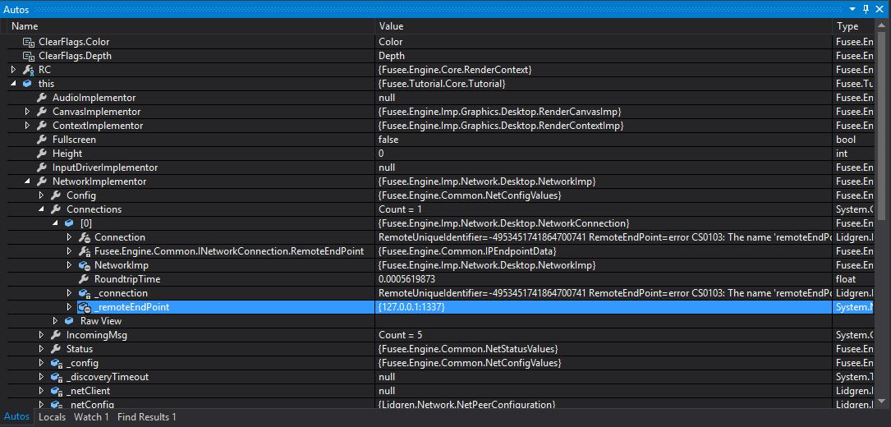
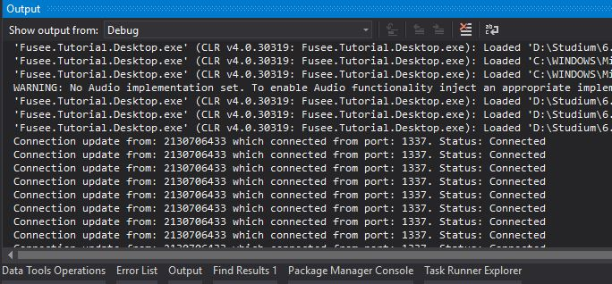
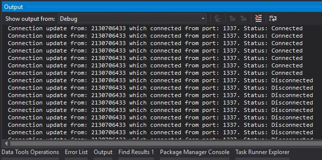
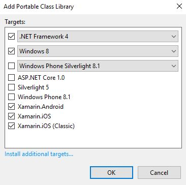
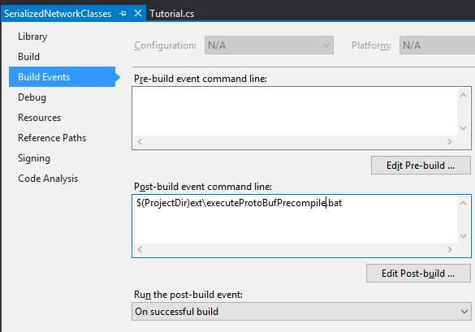
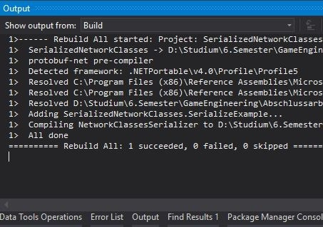
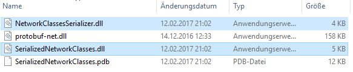
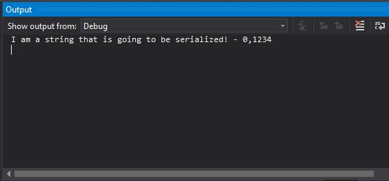

# Fusee Network Tutorial
This tutorial will help you getting started with the network capabilities with some examples for desktop. 
You will learn about how to establish a connection between a client and a server application, how to create these and send data over the network. The tutorial is based on the [sixth official Tutorial](https://github.com/griestopf/Fusee.Tutorial/tree/master/Tutorial06) from [Fusees tutorial page](https://github.com/griestopf/Fusee.Tutorial).

##Getting started
To make this tutorial as easy as possible, the client and server application are two seperated solutions. This will help you seperate the role of each application at any time.

Before you start, make sure you have the latest version of Fusee, your ```FuseeRoot``` enviroment variable is set on your system and points to the right location. Also build the ```Fusee.Engine.Imp.Network.Desktop.csproj``` in the ```Fusee.Engine.Simple.sln```. You will need the generated .DLL-File for the next steps.
To avoid problems by getting a connection you should disable your windows firewall.


##Your first connection with Fusee

###Server
To set up the server, go to the ```Init()``` method in ```Tutorial.cs``` from the ```Fusee.TutorialNetworkServer.sln``` and add the following lines:

  ```C#
  Network netCon = Network.Instance;
  netCon.Config.SysType = SysType.Server;
  netCon.StartPeer();
  ```
First you need a reference to the ```Network.Instance``` object, which is a singelton in Fusee. Next you configure this reference as server and start it. ```StartPeer()``` starts the server application on the default port 14242 but you can also start it on a custom port by passing it as a parameter.

That's it! The server runs on the default port and is available under your machines IP address (or 127.0.0.1 from the same machine).

###Client
Configuring the client application is similar. Add this to the ```Init()``` method in ```Tutorial.cs``` from the ```Fusee.TutorialNetworkClient.sln```:

 ```C#
  Network netCon = Network.Instance;
  netCon.Config.SysType = SysType.Client; ;

  netCon.StartPeer(1337);
  netCon.OpenConnection("127.0.0.1");
  ```
  
 Besides the configuration as client, you also have to start a peer (note that the client peer is started on a certain port, because the server runs on the same machine and already uses the default port 14242). Next you open a connection to a certain IP address (in this case to the localhost).
 
###Test your code
 To verify, that the client connects to your server follow these steps:
 
 - 1. Start the ```Fusee.TutorialNetworkServer.sln```
 - 2. Start the ```Fusee.TutorialNetworkClient.sln```
 - 3. Set a breakpoint somewhere in ```RenderAFrame()``` in ```Tutorial.cs``` in the server solution
 
When you look in the Autos window in Visual Studio and search for ```this.NetworkImplementor.Connections[0]._remoteEndpoint``` you should see the clients IP address and port, connected to the server:




###Make the server react to connecting clients
Now, that the client is connected with the server, you will see how to react on connection updates. Therefore you implement an event listener inside the servers ```RenderAFrame()``` method in ```Tutorial.cs```:

 ```C#
  Network.Instance.OnConnectionUpdate += ConnectionUpdate;
 ```
Everytime, a connection on the ```Network.Instance``` changes, ```ConnectionUpdate()``` is called. Implement the ```ConnectionUpdate()``` method somewhere in ```Tutorial.cs```:

 ```C#
 private void ConnectionUpdate(ConnectionStatus estatus, INetworkConnection connection)
 {
   Debug.WriteLine("Connection update from: " + connection.RemoteEndPoint.Address + " which connected from port: " + connection.RemoteEndPoint.Port + ". Status: " + estatus);
 }
 ```
 
Repeat the steps from the [Test your code](#test-your-code) section and look at the Output window in Visual Studio of your server solution. When the client application starts, you should see a similar message to this:



When you close the client application, the Output window should contain something like this:




You are now able to create a connection to a server and react to connection updates. In the next steps you will learn how to serialize and send data between both applications over the network.

##Send and receive serialized data
The reason why you are reading this tutorial, is probably that you want to send data over the network. This can only happen with serialized data. Fusee already uses a tool, espcially for seralizing data in C#, called [Protobuf](https://github.com/mgravell/protobuf-net). You will learn how to use this tool to serialize data for network usage.

###Set up Protobuf
Make sure to follow these steps carefully and in the right order. Setting up Protobuf is the most complex part of this tutorial.

First, add a new project to you server solution. This project will contain all classes that are serialized and can be send over the network. To add a new project rightclick the .sln file in the project explorer in Visual Studio, go to "Add" --> "New project..." choose "Class Library (Portable)" and name it "SerializedNetworkClasses". Finally click "Add" and set following configurations in the appearing window:



Next, open the "References" node from the recently added project, rightclick on it an select "Add Reference...". Click "Browse" in the lower right corner and browse to your Fusee directory. You can find the ```protobuf-net.dll``` in ```ext/protobuf```. Now **save** the SerializedNetworkClasses project. The ```protobuf-net.dll``` is now linked with an absolute path according to your Fusee installation and its directory. However, if you want to run your application on different machines, that have a different Fusee installation path, the ```protobuf-net.dll``` won't be found. To solve this problem, you have to link the .DLL file with a relative path to your ```FuseeRoot``` enviroment variable. To do this, rightclick on the SerializedNetworkClasses project and select "Open Folder in File Explorer". Find the ```SerializedNetworkClasses.csproj``` file and open it with an editor (i.e. Notepad++).
Locate the node that looks similar to this:

<div id="rellink"></div>
 ```XML
 <ItemGroup>
    <Reference Include="protobuf-net">
      <HintPath>..\..\..\..\..\Fusee\ext\protobuf\protobuf-net.dll</HintPath>
    </Reference>
 </ItemGroup> 
 ```
 
 Replace the ```<HintPath>``` node with a link, relative to your Fusee installation, using the enviroment variable:
 
 ```XML
 <HintPath>$(FuseeRoot)ext\protobuf\protobuf-net.dll</HintPath>
 ```

The next step is, to tell Protobufs precompile tool to use your ```SerializedNetworkClasses.dll``` which is generated when the project is build. Out of this .DLL file, the precompile tool will create a new .DLL that will allow you to serialize your classes inside the SerializedNetworkClasses project.
To run the precompile tool after each build, Visual Studio offers the possibility to execute post build events. Therefore, rightclick the SerializedNetworkClasses project in the solution explorer, select "Properties" and open the "Build Events" tab on the left.
Enter

```
$(ProjectDir)ext\executeProtoBufPrecompile.bat
```
in the Post-build event command line:



After this, you have to create a .bat file that executes the precompile tool. Open the folder containing the SerializedNetworkClasses.csproj file. In the same directory, add a new folder named "ext". Inside this folder create a new .bat file with the name "executeProtoBufPrecompile" and content:

```
%FuseeRoot%\ext\protobuf\PrecompileTool\precompile %~dp0\..\bin\Debug\SerializedNetworkClasses.dll -o:%~dp0\..\bin\Debug\NetworkClassesSerializer.dll -t:NetworkClassesSerializer
```

Now you can add your first class with data you want to serialize to the SerializedNetworkClasses project. For example, add new class named "SerializeExample" that could look like this:

```C#
using ProtoBuf;

namespace SerializedNetworkClasses
{
    [ProtoContract]
    public class SerializeExample
    {
        [ProtoMember(1)]
        public string exampleString;

        [ProtoMember(2)]
        public float exampleFloat;
    }
}
```

First, the class and all its fields have to be public. In addition the annotation ```[ProtoContract]``` is necessary to mark the class to be serialized. Also each field needs a ```[ProtoMember(id)]```annotation, where the *id* has to be a unique integer.

If you now rebuild the SerializedNetworkClasses, you should see "All done" in the Output window in Visual Studio:



In your "Debug" folder from the server solution you should see this two .DLL files:



In the last step, you have to integrate these two .DLL files and the ```protobuf-net.dll``` in you client and server application. To do this, rightclick the "References" node in the respective "Core" project of both applications, select "Add Reference..." and add the same ```protobuf-net.dll``` like before. Also add the two .DLL files located in the server applications Debug folder in the same way to both applications. **Save** your respective project. Don't forget to link (just) the ```protobuf-net.dll``` relatively to your ```FuseeRoot``` enviroment variable, like you did [before](#rellink).

If you are able to rebuild your projects, you did everything right.

###Finally send and receive data
Now, that Protobuf is set up, you will learn how to send and receive data. The next steps will show you, how to send data from the client and receive it on the server application.

####Client
Open the ```Tutorial.cs``` in the ```Fusee.TutorialNetworkClient.sln``` and add the following lines:

```C#
 private MemoryStream memoryStream = new MemoryStream();
 private byte[] serializedBytes;
 private NetworkClassesSerializer networkClassesSerializer = new NetworkClassesSerializer();
 private SerializeExample exmapleData = new SerializeExample();
```

<div id="descr"></div>
The ```memoryStream``` is used by the ```networkSerializer```, from the protobuf-generated ```NetworkClassesSerializer.dll```, which serializes the ```exampleData``` from ```SerializedNetworkClasses.dll```. The ```serializedBytes``` field is needed to use Fusees ```SendMessage()``` method, which expects a byteArray that contains the serialized data.

To fill the ```exampleData``` with example data, add this inside the ```Init()``` method:

```C#
 exmapleData.exampleString = "I am a string that is going to be serialized!";
 exmapleData.exampleFoat = 0.1234f;
```

Last, you have to implement the procedures described in the [paragraph above](#descr) inside the ```RenderAFrame()``` method.

```C#
 if (Keyboard.IsKeyDown(KeyCodes.Space))
 {
    memoryStream = new MemoryStream();
    networkClassesSerializer.Serialize(memoryStream, exmapleData);
    serializedBytes = memoryStream.ToArray();
    Network.Instance.SendMessage(serializedBytes, MessageDelivery.ReliableOrdered, 1);
    memoryStream.Dispose(); 
  }

```

Whenever the spacebar is pressed (and the application window is in focus), the client will serialize and send the ```exampleData``` object to the server. To actually send a message, you use the ```Network.Instance.SendMessage()``` method, also mentioned earlier, which expects a byteArray, a type of an enum that describes the way the packets are send over the network and a channel number on which the message is send.

####Server
In order to reveive messages on the server you also need a ```MemoryStream``` and ```NetworkClassesSerializer``` field in ```Tutorial.cs```:

```C#
 private MemoryStream memoryStream;
 private NetworkClassesSerializer networkClassesSerializer = new NetworkClassesSerializer();
```

Inside ```RenderAFrame()``` add the following lines:

```C#
 INetworkMsg msg;
            
 while ((msg = Network.Instance.IncomingMsg) != null)
 {
   if (msg.Type == MessageType.Data)
   {
     memoryStream = new MemoryStream(msg.Message.ReadBytes);
     SerializeExample exampleData = (SerializeExample)networkClassesSerializer.Deserialize(memoryStream, null, typeof(SerializeExample));

     if (exampleData != null)
     {
       Debug.WriteLine(exampleData.exampleString + " - " + exampleData.exampleFloat);
     }
    }
  }
```

In Fusee, messages also appear like a stream on the network. That's why you have to have to read them out of the ```Network.Instance.IncomingMsg``` object with the use of a while loop. Next we check the ```MessageType``` for ```Data```. The ```SendMessage()``` method we used in the client automatically declares the ```MessageType``` as ```Data```, but there are also other types available like ```DebugMessage```, ```ErrorMessage```, ```WarningMessage``` etc.
Next we have to read the bytes from ```msg``` into the recently created ```memoryStream``` and then deserialize them with the ```networkClassesDeserializer``` object. Note that the deserialized object is also casted to our expected type, we sent from the client.
Finally check if ```exampleData``` contains something and write its properties on the Output window in Visual Studio.

To test your code, start the server and the client application. Focus the client window that appears on start and press spacebar. If you look at the Output window from the server solution in Visual Studio you should see something like this:



Congratulations! You have send serialized data over the network from one application to another, using Fusees network capabilities!
You learned the basics to develop a network-based application and are ready to go. [Below](#best-practices) you will find some Best Practices and advice that may help you.


##Best Practices
Some of these advice are implemented in the [Hot Potatoe Wuggy Game](#), which can also be used to get familiar with Fusees network capabilities.

###Use different channels to send several objects
Use differend channels to send messages on the sending application:

```C#
//send on channel 1 and 2
Network.Instance.SendMessage(serializedBytes, MessageDelivery.ReliableOrdered, 1);
Network.Instance.SendMessage(serializedBytes, MessageDelivery.ReliableOrdered, 2);
```

On the receiving application use:
 ```C#
 INetworkMsg msg;

 while ((msg = Network.Instance.IncomingMsg) != null)
 {
               
   if (msg.Type == MessageType.Data)
   {
     switch (msg.Message.MsgChannel)
     {
       case 1:
         //Message arrives on channel 1
         //desirialize object from type foo
       break;

       case 2:
         //Message ariives on channel 2
         //desirialize object from type bar
       break;
     }
   }
 }
 ```
 
###Avoid serializing objects like ```List```
Due to asynchronious code execution from server and client, objects like ```List```s often contain ```null``` sequences, so try to handle these only locally and rather work with single object that are send over the network, than sending the whole ```List```.
 
###Use the server as central unit
To keep everything synchronious especially if you have multiple clients connected to your server, let the server do all calculations and distribute the results to the clients. Just send the information from the client to the server and let it handle these data. So every client will get the same results that don't differ from one another.

###Use more tiny classes than one huge
It's important to keep in mind, that the traffic over the network should always be as small as possible. Therefore it's usually better to serialize and send small classes, than doing this with one huge class, although you just need a single property on the receiving side.

##Time to practice
* Also print the ```MessageChannel``` on the Output window
* Serialize and send a second class with other properties from client to server, when the "L" key is pressed
* Send a message from the server to client application and print it out.
